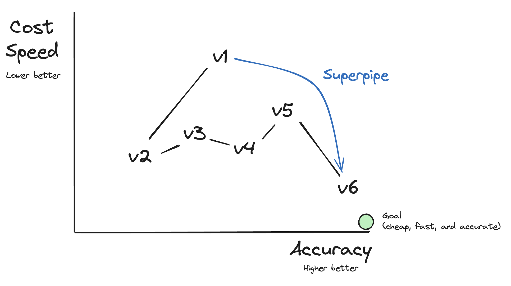

# Introducing Superpipe

By [Aman Dhesi](https://twitter.com/amansplaining) and [Ben Scharfstein](https://twitter.com/benscharfstein)

<iframe width="560" height="315" src="https://www.youtube.com/embed/enJ2EB_qf1E?si=yCPDnCt4AwmE69AZ" title="YouTube video player" frameborder="0" allow="accelerometer; autoplay; clipboard-write; encrypted-media; gyroscope; picture-in-picture; web-share" referrerpolicy="strict-origin-when-cross-origin" allowfullscreen></iframe>

_Superipe is a lightweight framework to build, evaluate and optimize LLM pipelines for structured outputs: data labeling, extraction, classification, and tagging. Evaluate pipelines on your own data and optimize models, prompts and other parameters for the best accuracy, cost, and speed._

---

## Why we built Superpipe

For the past few months we've been helping companies with structured data problems like product classification and document extraction.

Through working on these projects, we noticed a few problems.

1. Many companies were doing “vibe-check” engineering with LLMs and had **no idea how accurate their prompts and pipelines were.**
2. Usually this was because they didn't have labeled data to evaluate on. Even when they did, their **labels were often inaccurate.**
3. And they **lacked tools to rigorously compare** different approaches, prompts, models and parameters. This resulted in a mess of experiments spread across notebooks.

Despite these limitations, we were able to get very high quality results. First, we learned that LLMs are actually very good at classification and extraction when used correctly. Second, we came to the conclusion that multi-step techniques worked quite well on a wide variety of use cases and outperformed zero-shot prompting much of the time. And finally, we observed that there’s usually a lot of cost and speed headroom without a loss in quality if you use cheaper models for “easy” steps, and expensive models for “hard” steps.

After a few experiments and projects, our process became:

1. **Build** and run a v1 pipeline with a powerful model like GPT-4 for each step.
2. **Evaluate** our pipeline by manually labelling ground truth data.
3. **Optimize** the pipeline over prompts, models, and other parameters.

We built Superpipe to productize the the process of building, evaluating and optimizing the multi-step LLM pipelines we built. **With Superpipe, we’re able to build 10x cheaper pipelines, 10x faster.**

Today we’re open-sourcing Superpipe under the MIT license so that you can build faster, better, and cheaper pipelines as well. You can view the source code [here](https://github.com/villagecomputing/superpipe).

## Superpipe helps engineers think like scientists

As ML engineers (even before LLMs) we knew the importance of high quality ground truth data and proper evaluation metrics. However, what we learned is that those without experience building probabilistic systems hadn’t necessarily learned those lessons yet. Now that every engineer can use AI with a few lines of code, it’s important that [engineers start thinking more like scientists.](https://www.scharfste.in/evaluation-is-all-you-need-think-like-a-scientist-when-building-ai/)

To put it in traditional software engineering terms, Superpipe brings test driven development to LLM pipelines. You can think of each labeled data point as a unit test. You wouldn't ship traditional software without units tests and you shouldn't ship LLM software without evals.

Tests will help you evaluate accuracy, but that’s only half the equation. When building with LLMs, there’s generally a tradeoff between cost/speed and accuracy. On the same pipeline and prompts, cheaper models are generally faster and but less accurate.

However, pipelines aren’t static. You can vary prompts, augment with retrieval, chain LLMs, enrich with public information and more. Superpipe will help you iterate faster and build cheaper and more accurate classification and extraction pipelines. In many cases, you can skip straight from v1—>v6.

## How it works

There are three steps to using Superpipe:

1. **Build -** create a multistep Pipeline using Steps
2. **Evaluate** - generate and label ground truth data. Evaluate your results on speed, cost and accuracy.
3. **Optimize** - run a Grid Search over the parameters of your pipeline to understand the tradeoffs between models, prompts, and other parameters.

The result of this process is a rigorous understanding of the cost, speed, and accuracy tradeoffs between different approaches, conveniently presented to you right in your notebook.

## Learn more

The best way to learn more about Superpipe by reading our [docs](https://docs.superpipe.ai), checking out our [Github](https://github.com/villagecomputing/superpipe), or asking questions on our [Discord](https://discord.gg/paV2qcHmH7).
